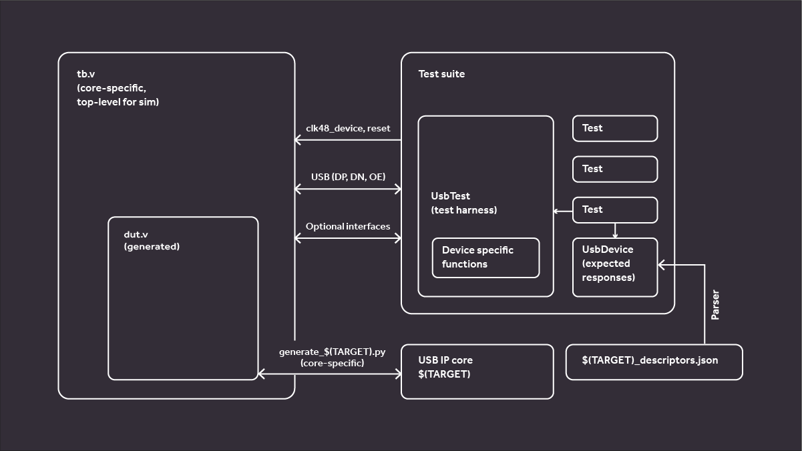

Project architecture
====================

    Structure of project files.

IP cores under test are wrapped in Python adaptation code using `LiteX`_. This provides a unified interface for other parts of the testbench.
The wrapper code for the whole system is translated to Verilog for simulation.
For communication with the simulator `cocotb`_ module is used.
Expected descriptor values are stored in a human-readable JSON format.

Repository structure
--------------------

Main repository for the project that gathers needed dependencies is `usb-test-suite-build`_.
Project code lives in two repositories:

`usb-test-suite-cocotb-usb`_
^^^^^^^^^^^^^^^^^^^^^^^^^^^^

This repository contains functions for triggering and verifying USB transfers from host side, packaged as a Python module.

`usb-test-suite-testbenches`_
^^^^^^^^^^^^^^^^^^^^^^^^^^^^^
In this repository the test cases are stored, along with configuration and wrapper files for supported IP cores.

Other submodules
^^^^^^^^^^^^^^^^

* `LiteX`_ - used to write the wrapper system in Python
* `yosys`_ - provides simulation libs for some of the targets
* repositiories of the tested submodules

.. _`LiteX`: https://github.com/enjoy-digital/litex
.. _`cocotb`: https://github.com/cocotb/cocotb
.. _`yosys`: https://github.com/YosysHQ/yosys

.. _`usb-test-suite-build`: https://github.com/antmicro/usb-test-suite-build
.. _`usb-test-suite-cocotb-usb`: https://github.com/antmicro/usb-test-suite-cocotb-usb/tree/master
.. _`usb-test-suite-testbenches`: https://github.com/antmicro/usb-test-suite-testbenches/tree/master

